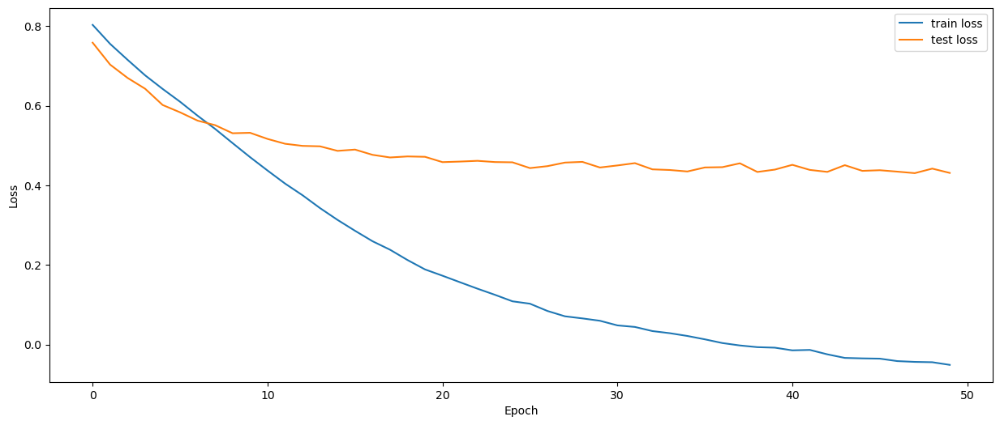
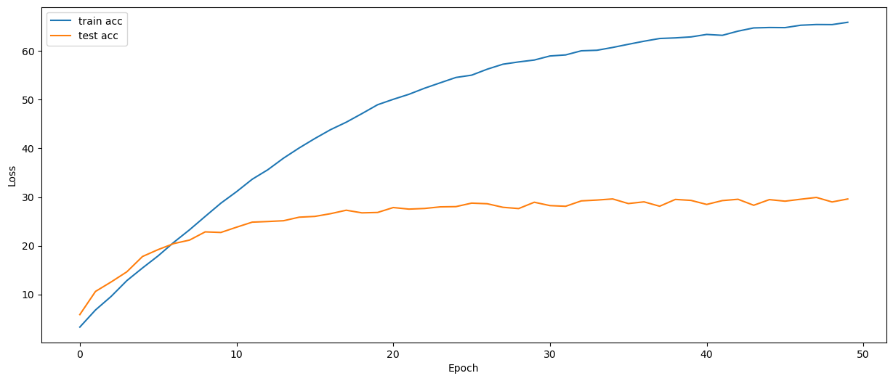

### Accuracy and Loss Plots
Due to resource constraints, and Google Colab disconnecting me from the runtime at very frequent intervals, I was only able to run train the model for 50 epochs before it crashed.

I had not implemented checkpoints and resuming training with the first version of my code, as it seemed pointless to do so, but in hindsight, it should have been one of the first things I did.

Train and Test loss v/s No. of epochs

Train and Test accuracy v/s No. of epochs
